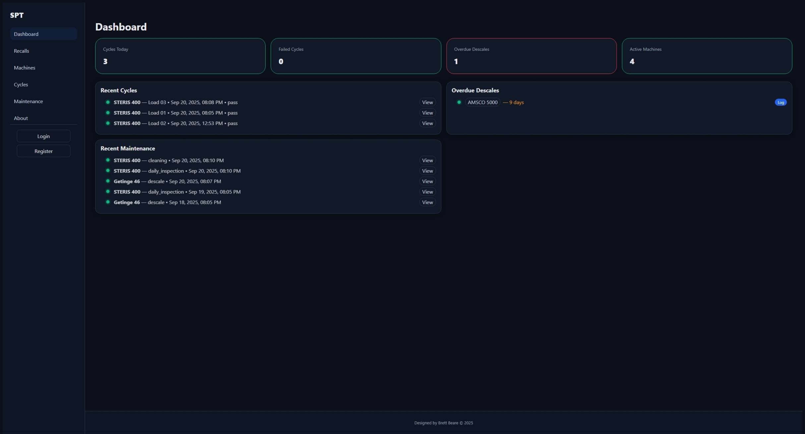
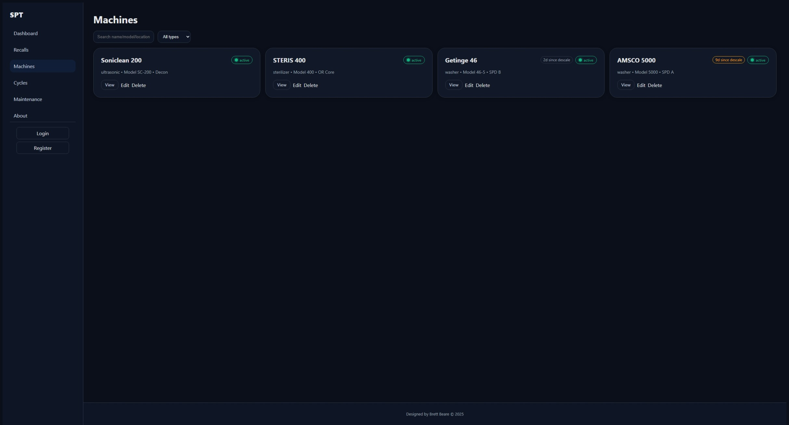
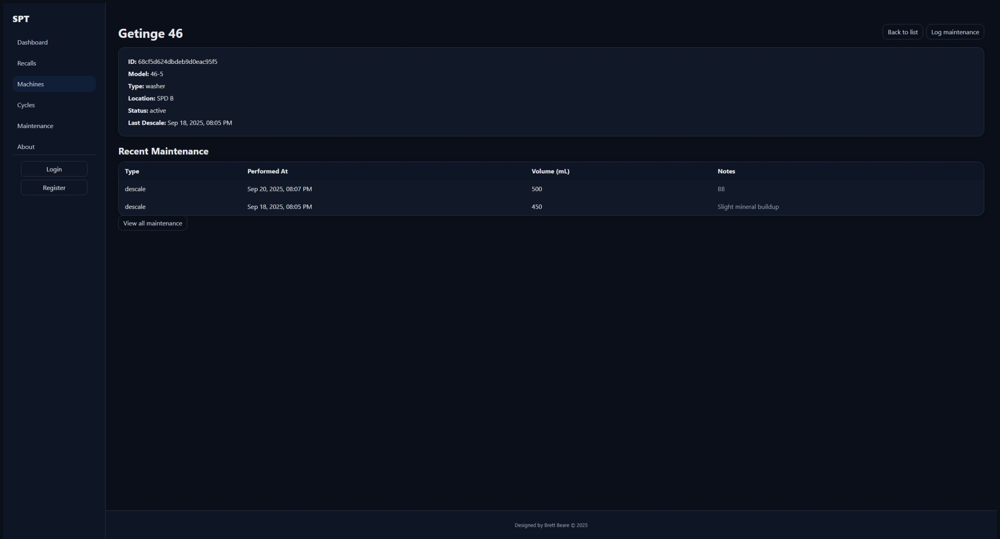
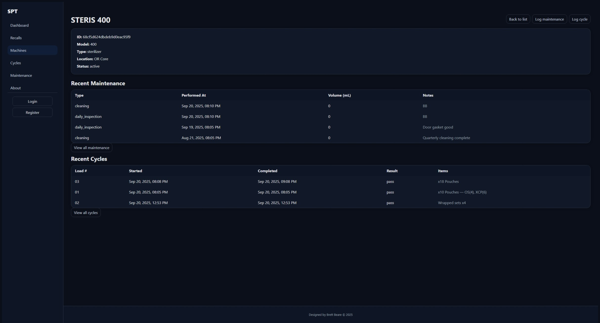
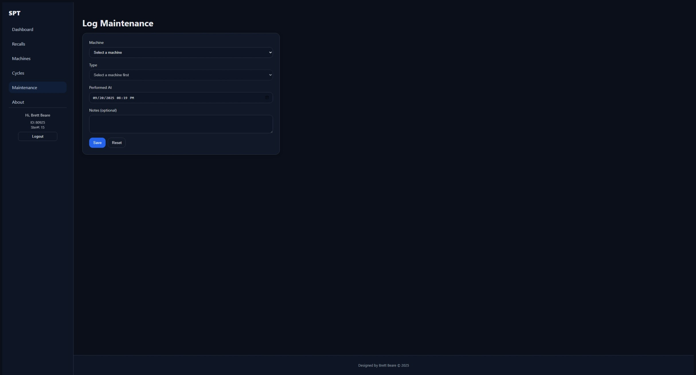
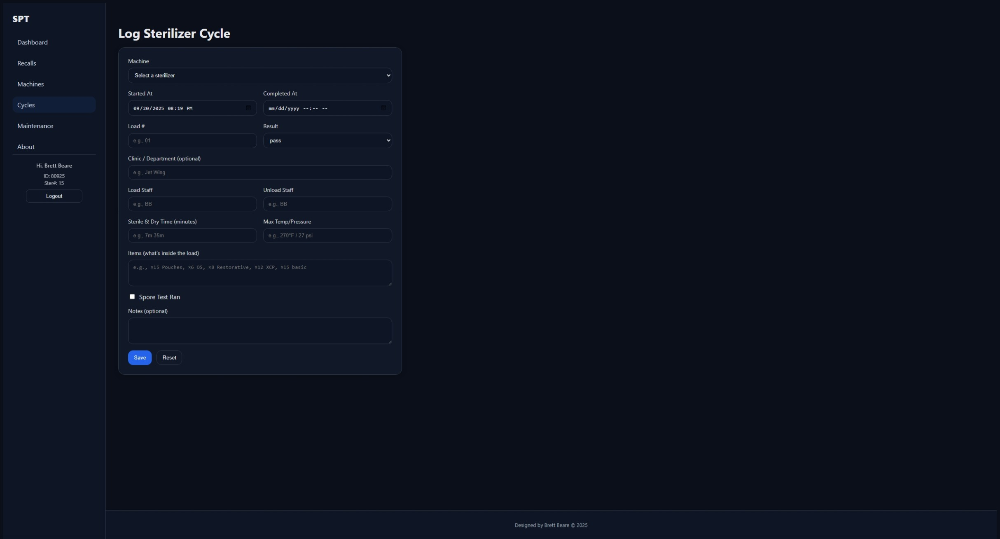
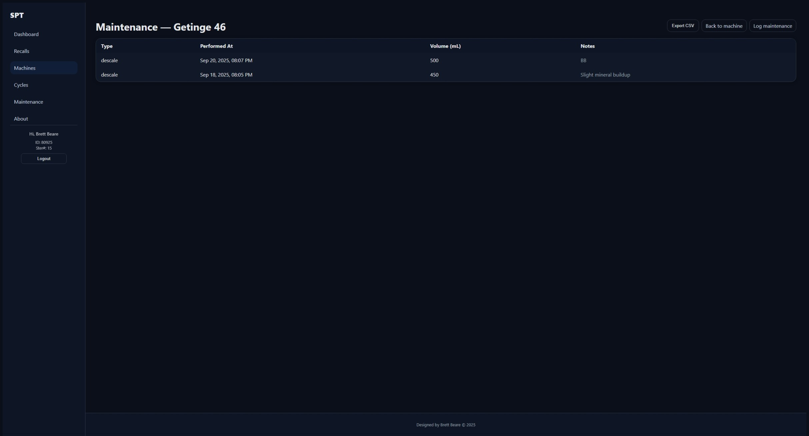
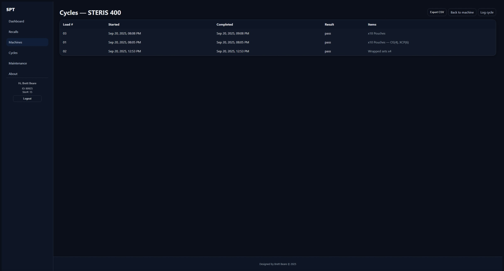
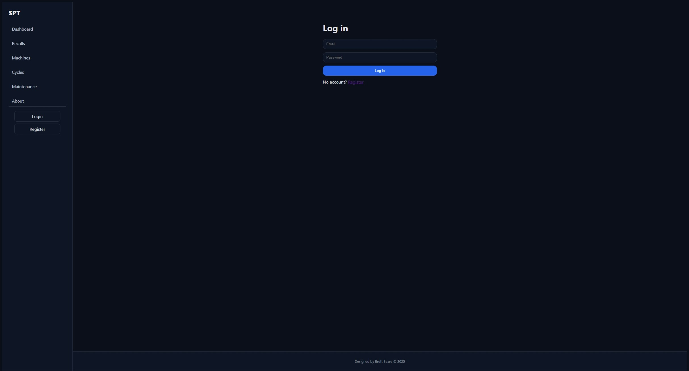
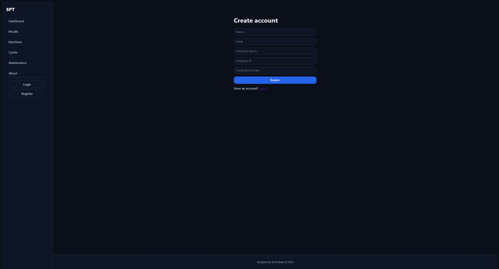

# Sterile Processing Tracker (SPT)

A modern web app to track sterile processing equipment, maintenance, and sterilizer cycles (loads).  
Built with **React (Vite)**, **Express**, **MongoDB**, and **JWT auth**.

---

## ✨ Features

- **Machines**: add/edit/delete washers, sterilizers, ultrasonics
- **Maintenance**:
  - Washers/Ultrasonic: **Descale** (with “days since” tracking)
  - Sterilizers: **Daily Inspection** & **Quarterly Cleaning**
- **Sterilizer Cycles (Loads)**: items, result, load #, staff, spore test details
- **Dashboard**: KPIs + Today’s Sterilizer Cycles + Recent Maintenance
- **Machine Detail**: recent maintenance & recent cycles, links to “View all…”
- **CSV Export** for per-machine maintenance & cycles
- **Auth**: register/login/logout, protected write routes
- **UI polish**: toast notifications, loading skeletons, consistent card/layout

---

## 📦 Monorepo Layout

- `apps/`
  - `server/` → Express API + MongoDB
  - `web/` → React client (Vite)

---

## 🚀 Run Locally

### Install dependencies (from root)

```bash
  npm install
```

### Copy .env.example → .env and update values:

```env
PORT=3001
CLIENT_URL=http://localhost:5173
MONGO_URI=mongodb://localhost:27017/spt
JWT_SECRET=dev-super-secret-change-this
JWT_EXPIRES_IN=7d
```

### (Optional) seed demo data

```bash
   node apps/server/scripts/seed.js
```

### Start servers (two terminals)

```bash
   npm run dev:server # Express on :3001
   npm run dev:web # Vite on :5173
```

---

### 🏗️ Build for Production

##### Build client

```bash
   npm run build:web
```

#### Start API (serve client via any static host or a reverse proxy)

```bash
   npm run start:server
```

---

### Useful Scripts

- dev:server — nodemon API

- dev:web — Vite dev server

- build:web — Vite client build

- start:server — start API

- seed — seed sample data

---

## 🔌 API Overview

Auth

- POST /api/auth/register — { email, password, name, employeeId?, sterilizationNumber? }

- POST /api/auth/login

Machines

- GET /api/machines

- GET /api/machines/:id

- POST /api/machines (auth)

- PUT /api/machines/:id (auth)

- DELETE /api/machines/:id (auth)

Maintenance

- GET /api/maintenance?machineId=&limit=

- POST /api/maintenance (auth)

- Washer/Ultrasonic: type="descale" (+ volumeUsedMl)

- Sterilizer: type="daily_inspection" or type="cleaning" (no volume)

Cycles

- GET /api/cycles?machineId=&date=YYYY-MM-DD&limit=

- POST /api/cycles (auth)

Auth uses Authorization: Bearer <jwt>.

---

## 🔒 Security & Validation

- Server validation with Zod + Mongoose schemas

- Write endpoints protected by JWT

- CORS restricted to CLIENT_URL

- Helmet enabled for sensible headers

---

## 🗃️ DB Indexes

- Maintenance: { machineId: 1, performedAt: -1 }

- Cycles: { machineId: 1, startedAt: -1 } and { startedAt: -1 }

---

## ✅ Reviewer Walkthrough

1. Login with demo user (or register)

   - Use the seeded demo data or register/login with your own account.

2. Dashboard: see KPIs + Today’s Sterilizer Cycles + Recent Maintenance

3. Machines: add → edit → delete a machine (auth required)

4. Machine Detail:

   - Washer: log Descale → appears on detail & dashboard

   - Sterilizer: log Daily Inspection/Quarterly Cleaning → appears on detail & dashboard

   - Click View all maintenance / View all cycles

5. Cycles: log a sterilizer cycle (load #, items, result)

6. Export CSV from “View all …” pages

---

### Dashboard



### Machines



### Machine Detail — Washer



### Machine Detail — Sterilizer



### Log Maintenance Form



### Log Cycle Form



### Maintenance History (with CSV export)



### Cycles History (with CSV export)



### Login



### Register


